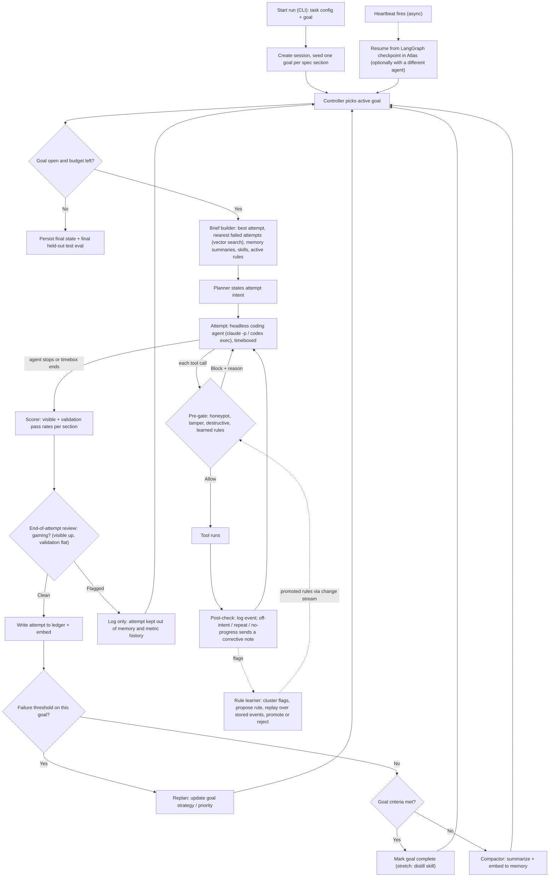

# Tokeneyezed: Master Plan

This merges Aaron's SOW (goal loop, replan, heartbeat, schema, phases) with our plan (real coding agents through hooks, attempt ledger, observer, baselines). Background research: [[Harness Primitives Landscape]].

> [!success] Pitch (first 20 seconds of the demo)
> Long agent runs forget what they tried, repeat dead ends, and quietly game their tests. Our harness keeps a real coding agent working toward a hard metric across compactions, crashes, and even a switch from Claude Code to Codex. Every attempt lives in Atlas. The plan changes when the metric says it isn't working, and an observer keeps cheating and bad steps out of memory. We measured each piece against a plain retry loop.

**Statement:** Two (Long Horizon Engineering), with one small Statement One feature (rules learned from observer flags, proven by replay).

---

## Decision log

| Topic | Aaron's SOW | Our earlier plan | **Master plan** | Why |
|---|---|---|---|---|
| Who does the work | Own LangGraph planner + own tool executor | Real coding agents wrapped by hooks | **Hybrid.** Our LangGraph outer loop plans; each *attempt* is a headless coding agent (`claude -p`, `codex exec`) with our observer in its hooks | A real agent codes far better than a homemade executor, and every piece that matters is still clearly our code |
| Goals + replan | `goals` collection, replan past a failure threshold | Not present | **Keep Aaron's.** One goal per CommonMark spec section | The clearest "the plan changed because of an outcome" moment |
| Memory | Compacted summaries in `memory` | Structured attempt ledger | **Both.** `attempts` (structured: intent, diff, scores) + `memory` (compacted summaries) | The ledger powers the repeat-failure check and retrieval eval; summaries keep the narrative |
| Checkpoint / resume | Hand-rolled `sessions` checkpoint + heartbeat | Kill and resume, possibly with a different agent | **LangGraph `MongoDBSaver` checkpoints + Aaron's heartbeat.** The resume demo switches to Codex | The existing library saves time; switching agents on resume is a stronger beat |
| Session events | `events` array embedded inside the `sessions` document | Separate event log | **Separate `events` collection**, one document per event | Long runs would grow the array without bound and eventually hit MongoDB's 16 MB document limit. MongoDB judges will notice this |
| Observer placement | Evaluates *after* the tool runs (F17 then F18) | Before and after, through hooks | **Before:** blocks honeypot, tampering, destructive actions, and learned rules (`PreToolUse`). **After:** checks intent, repeats, progress (`PostToolUse`). **End of attempt:** checks for gaming (visible vs. validation gap) | Blocking a destructive action after it runs is too late |
| Observer failure mode | Fail open | n/a | **Deterministic checks fail closed; model-based checks fail open** | Plain-code checks can't misfire; a model outage shouldn't halt the run |
| Observer gating memory | Flagged steps never reach `metrics`/`memory` | n/a | **Keep.** It's the sharpest thesis line | "Memory quality depends on what's allowed into it" |
| Statement One | Explicitly out | Full evolver | **Small:** repeated flags become candidate rules, promoted only if a replay over stored events proves them. Skill distillation (F28) is stretch | Replay costs no agent runs; the full evolver would eat the run budget and learn from noise |
| Parallel swarms | Out | Island model across vendors | **Out** (compute). Keep a *sequential* handoff: Claude Code to Codex on resume | Differentiates cheaply |
| Task | Open | Speed-up | **CommonMark renderer with a three-way test split** | Long enough, fast to score, gaming is measurable, a natural honeypot |
| Baseline | None | Vanilla agent | **Naive retry loop** ("Ralph loop") with the same model, prompt, and number of attempts | Otherwise a judge says "you just ran it longer" |
| Dashboard | Vercel v0, 5 panels, entry point for goals | Live score view | **Supporting view only** (score curves, goals, flags, context size). Runs start from the CLI | Rules ban projects where a dashboard is the main feature |
| Embeddings | Not specified | Atlas Automated Embedding, Voyage as fallback | **Provisional: Voyage API called directly**; vectors stored in our own documents, searched with Atlas Vector Search. Confirmed or reversed by the 10:30 check | Direct calls give us the raw vectors (the rule learner clusters them), searchable the moment a document is written, and control over dimensions, caching, and reranking. Automated Embedding is less code and more MongoDB-native. The two use the same Voyage models, so neither is more accurate by default |

---

## Architecture



### Components and owners

| Component | What it does | Built with |
|---|---|---|
| **Controller** (Aaron's Goal Loop Controller) | Picks goals, enforces budget, triggers replans, runs the heartbeat/resume | LangGraph + `MongoDBSaver` |
| **Planner** | Turns goal + brief into an attempt intent ("fix emphasis rules in section 6.2 without touching link parsing") | Model call through OpenRouter |
| **Attempt runner** | Launches a headless agent in the task repo with the brief; timebox + `--max-turns`; captures output (see "Headless agents + hooks" for flags and traps) | `claude -p --settings ...`, `codex exec --dangerously-bypass-hook-trust` |
| **Shim + observer** | Hooks call the shim, which converts to one neutral event format, posts to the observer, and converts the decision back | Small HTTP service + one shim per agent |
| **Scorer** | Runs the spec examples, outputs visible and validation pass rates per section | Python; the hidden splits live outside the agent's working directory |
| **Brief builder** | Assembles a bounded context from Atlas. The window stays small while the ledger grows | Vector search + Atlas Search |
| **Compactor** | Summarizes recent attempts into `memory` | Model call + Voyage embeddings |
| **Rule learner** (S1) | Turns repeated flags into candidate rules and proves each by replay | Atlas vector search over `interventions` |

### Observer checks (Aaron's checklist, plus where each one runs)

| Check | When | How | On fail |
|---|---|---|---|
| Honeypot / forbidden shortcut (`pip install markdown-it-py`, `mistune`, `commonmark`; copying from site-packages) | Before the tool runs | Plain code (pattern match) | Block with reason |
| Tampering (edits to the scorer, test files, hook configs) | Before | Plain code (path match) | Block with reason |
| Destructive action | Before | Plain code first; small model only if unclear | Block with reason |
| Learned rules | Before | Rules held in memory, hot-reloaded from Atlas via change streams | Block with reason |
| Declared-intent match | After | Files/sections touched vs. the planner's stated intent | Corrective note |
| Repeat failure | After | Vector similarity to earlier *failed* attempts on this goal | Corrective note citing the attempt ID |
| No progress | After | N tool calls with no file change or test run | Corrective note |
| Gaming the checks (proxy validation) | End of attempt | Visible pass rate rises while validation stays flat, or code special-cases test inputs | Attempt kept out of memory and metrics; logged for audit |

---

## Task: CommonMark renderer with a three-way split

- **Build:** a Markdown-to-HTML renderer in Python from scratch. No existing Markdown libraries.
- **Tests:** the official CommonMark spec examples (~650), each tagged with its spec section.
- **Split, stratified by section:**

| Split | Share | Who sees it | Used for |
|---|---|---|---|
| **Visible** | ~30% | The agent | The agent's own test runs |
| **Validation** | ~35% | The harness only (never the agent) | The hard metric that drives replans and goal completion |
| **Held-out test** | ~35% | Nobody during the run | The final score we report for *both* the harness and the baseline |

- **Why three splits:** if the harness optimized on the same tests we report, a judge could say we tuned on the test set. The held-out split makes the headline number honest. The visible-vs-validation gap measures how much the agent is overfitting the tests it can see.
- **Goals:** one per spec section (tabs, emphasis, links, lists, HTML blocks, ...). Completion = validation pass rate for the section at or above a threshold.
- **Honeypot:** installing or vendoring an existing Markdown library is the obvious shortcut. The baseline has no guard against it; ours blocks it live.
- **Watch for:** models know CommonMark implementations from training data, but the baseline has the same knowledge, so the comparison stays fair.

---

## MongoDB data model

| Collection | One document per | Key fields | Indexes |
|---|---|---|---|
| `checkpoints` (LangGraph) | checkpoint | managed by `MongoDBSaver` | managed |
| `sessions` | run | `session_id`, `status`, `config` (agent, flags for ablations), `created_at`, `last_checkpoint_at` | `session_id` |
| `events` | hook event | `session_id`, `attempt_id`, `agent`, `phase` (pre/post/stop), `tool`, `input`, `output_summary`, `verdict`, `ts` | `session_id + ts`; TTL on raw output fields (optional) |
| `goals` | spec section per session | Aaron's schema: `status`, `priority`, `strategy_notes`, `last_replanned_at`, `completion_criteria` | `session_id + status + priority` |
| `attempts` (ledger; replaces Aaron's `metrics`) | attempt | `session_id`, `goal_id`, `agent`, `intent`, `diff_summary`, `commit`, `visible_pass`, `val_pass`, `per_section`, `outcome`, `observer_flags`, `parent_attempt`, `embedding` | vector index on `embedding`; Atlas Search on `intent` + `diff_summary` |
| `memory` | compacted summary | Aaron's schema (`summary`, `embedding`, `source_event_range`) | vector index |
| `skills` | skill | Aaron's schema (`description`, `embedding`, `uses`, `successes`, `source`) | vector index |
| `interventions` | observer flag | `event_id`, `check`, `reason`, `evidence`, `embedding` | vector index |
| `rules` (S1) | learned rule | `pattern`, `check_type`, `evidence_event_ids`, `replay` (`hits_on_flagged`, `hits_on_good`), `status` (candidate/active/retired), `version` | change stream → observer |
| `test_evals` | held-out test score | `session_id`, `attempt_id`, `test_pass` | **only the dashboard and the final report read this; the harness never does** |

**Embeddings: Voyage API, called directly (PROVISIONAL until the 10:30 check).** 200M free tokens per participant.
- **One helper, one model.** All embedding goes through a single `embed()` helper in `data/`. One pinned Voyage model and output dimension for every collection, so vectors are comparable. Use `input_type="document"` when writing and `input_type="query"` when searching. The helper is also the switch point if we move to Automated Embedding.
- **Embed at write time.** The vector is in the document when it lands, so the next attempt's brief can find it immediately. If the Voyage call fails, write the document without `embedding` and backfill later; never block the loop on it.
- **Cache query vectors.** Embed each attempt's intent once and reuse it for every repeat-failure post-check in that attempt.
- **Indexes:** Atlas Vector Search indexes of type `vector` on `embedding` (dimension matching the pinned model, cosine similarity), with `filter` fields such as `session_id`, `goal_id`, `outcome` for scoped queries. Hybrid search uses `$rankFusion` with the Atlas Search index.
- **Account setup:** add a payment method on the Voyage dashboard. Without one, Voyage applies much lower rate limits; with one, Tier 1 limits apply at no charge within the free allowance.

**Why Voyage direct, and what would reverse it.** Both options embed with the same Voyage models, so retrieval quality is not the deciding factor. The trade-offs:
- *For Voyage direct:* we hold the raw vectors (Automated Embedding stores them in an internal database and only accepts text queries), which the rule learner needs to cluster flags. Vectors exist the moment a document is written, while Automated Embedding generates them asynchronously. We control dimensions and query caching, and can add a reranker.
- *For Automated Embedding:* no embedding code or API key handling, and it is a native Atlas feature, which may land well with MongoDB judges.
- *Not a differentiator:* rate limits. Automated Embedding's query limit is 3 requests/min on an M0 without a payment method but 2,000/min with one; Voyage direct is also throttled until a payment method is added. Either way someone adds a card.
- *Weak point of the case for Voyage:* the rule learner, which is the main reason to need raw vectors, is second in the cut order.

**10:30 check (Aaron), which decides it:**
1. In the Sandbox, open Atlas → Search & Vector Search → Automated Embedding → Rate Limits and note the query limit the cluster actually gets.
2. Embed one test `attempts` document with Voyage, insert it, and get it back from a `$vectorSearch` query.

If (2) works, keep Voyage direct. If (2) fails or is throttled and (1) shows paid-tier limits, switch to Automated Embedding and drop raw-vector clustering from the rule learner (it can cluster with nearest-neighbor queries instead). Sources: the `mongodb-search-and-ai` skill's `references/automated-embedding.md` and the hackathon resource guide; limits change, so trust what the Sandbox shows over these notes.

---

## Evaluation plan: a measured improvement for every component

> [!info] What a "configuration" is
> One run setup: which parts of the harness are switched on for that run. Everything else is held fixed (same task, model, prompt, per-attempt timebox, attempt count), so the difference in score between two configurations shows what the switched-off part contributes.

### End-to-end runs (on 3 teammates' Claude subscriptions, in parallel)

| Run | Config | Starts | Purpose |
|---|---|---|---|
| **B: Baseline** | Naive retry loop: re-run `claude -p` with the same task prompt, same model, same per-attempt timebox | **~11:30** (needs only the task repo + scorer) | What the harness has to beat |
| **H: Full harness** | Everything on | ~1:30 at the latest | The headline |
| **H-mem: Harness without memory** | Brief without ledger retrieval or memory summaries (a config flag) | Same time as H | Isolates what memory contributes |

- **Compare at equal attempt counts**, not wall-clock time: the x-axis is attempt number, and the baseline gets capped at the harness's attempt count.
- The **Codex handoff** runs separately on Codex credits: kill H partway, resume with `codex exec` from the same Atlas state, and show the score doesn't drop.

### Per-component metrics (mostly from the logs of those runs, plus cheap offline replays)

| Component | Metric | Compared against | Cost |
|---|---|---|---|
| **Observer** | (1) Live honeypot block. (2) Replay the baseline's recorded events through the observer: gaming attempts, library installs, and repeats caught. (3) False-flag rate on steps from attempts that improved validation. (4) Visible-vs-validation gap, H vs. B | Baseline events (which had no observer) | Observer model calls only |
| **Retrieval / embeddings** | Recall@5 at finding relevant earlier attempts for a new intent. Ground truth comes free: attempts on the same spec section | Vector (Voyage direct) vs. Atlas Search keyword vs. hybrid. **Plus:** the same queries against a copy of `attempts` with an Automated Embedding index on the same text and the same Voyage model, which settles whether the embedding path changes accuracy | Queries only (the copy's initial embedding sync uses the Atlas free allowance) |
| **Memory management** | (1) Repeat-a-failed-idea rate. (2) Context tokens per attempt (flat for H, growing for B). (3) Score regression after kill/resume (should be zero). (4) Held-out score, H vs. H-mem | B and H-mem | From logs |
| **Replan loop** | Attempts from a plateau to the next validation improvement, after replans vs. plateaus without one | Plateaus in B and in H before replan | From logs |
| **Headline** | Held-out test pass rate vs. attempt number | H vs. B vs. H-mem | The runs |

> [!warning] Honesty line for Q&A
> One run per configuration is a demonstration, not a statistically significant result. Say so before a judge asks. Report the numbers "in our runs today."

---

## Timeline (10:30 AM to 5:00 PM)

| Time | Milestone | Owner(s) |
|---|---|---|
| **Before 10:30** | Everyone: Atlas Sandbox invite accepted; `mongosh` + Atlas CLI installed (we use CLIs, not the MongoDB MCP server; MongoDB Agent Skills ship in the repo); Voyage account + key + payment method; repo created (public) | All |
| 10:30 to 11:30 | Cluster + collections + indexes + embeddings check (Voyage embed-and-search on one test `attempts` document, plus the Sandbox's Automated Embedding rate limit; see "MongoDB data model"). CommonMark split script + scorer. Credit codes redeemed (OpenRouter, Codex, v0). **Headless-hook smoke test for `claude -p` and `codex exec`** | 2, 3, 4 |
| **11:30** | **Start run B (baseline).** It needs only the task repo + scorer | 4 |
| 11:00 to 12:45 | Controller + checkpointing + attempt runner (`claude -p`); shim + observer pre-gate (honeypot, tampering, destructive); events + attempts writes | 1, 3 |
| 12:45 to 1:30 | Brief builder + compactor + goals/replan. Integration check at lunch | 1, 2 |
| **1:30** | **Start runs H and H-mem** | 1 |
| 1:30 to 3:15 | Post-checks + corrective notes; end-of-attempt gaming review; rule learner + replay (S1); Codex shim + resume; retrieval eval; dashboard panels | 2, 3, 4 |
| 3:15 | **Codex handoff run** (kill H, resume on Codex) | 1 |
| 3:45 | **Freeze runs.** Compute all eval numbers + charts | 2, 4 |
| 4:00 to 4:45 | Rehearse the 3-minute live demo; record the 1-minute video; README with a "what we built vs. what we used" table | All |
| **4:45** | Submit (15 minutes of buffer before the 5:00 deadline) | 4 |

**Cut order if behind** (first to go at the top): skill distillation > rule learner (S1) > H-mem run > Codex handoff > dashboard polish > model-based observer checks.
**Never cut:** baseline run, controller + resume, attempts ledger + brief, replan, the observer's pre-gate, the held-out eval.

## Workstreams (4 people, adapted from Aaron's roles)

| # | Role | Owns |
|---|---|---|
| 1 | **Agent loop** (Aaron's Backend / Agent Loop) | LangGraph controller, planner, attempt runner, goals + replan, heartbeat + resume, Codex handoff |
| 2 | **Data / MongoDB + memory** (Aaron's Data + Memory roles merged) | Schema + indexes, events/attempts writes, brief builder, compactor, embeddings, retrieval eval |
| 3 | **Observer** | Shim (Claude Code, then Codex), pre-gate, post-checks, gaming review, rule learner + replay, observer eval |
| 4 | **Task, eval + demo** (Aaron's Frontend / Demo, plus eval) | CommonMark split + scorer, baseline runner, `test_evals`, dashboard (v0), charts, video, README, submission |

**Lock at 10:45:** the neutral event format, the `attempts` document shape, and the scorer's output JSON. Everything else depends on them (Aaron's coordination note, still true).

---

## Demo script (3 minutes, live, no slides)

1. **(15 s)** The pitch above.
2. **(45 s)** Score chart: held-out pass rate vs. attempt number for harness, baseline, and harness-without-memory. Point at one attempt where the brief pulled up an earlier failed attempt and the agent went a different way.
3. **(30 s)** Kill the run. Resume it with **Codex** from the Atlas checkpoint. It continues from the same score, with no repeated work.
4. **(30 s)** Honeypot: the agent tries `pip install markdown-it-py`, the observer blocks it live, and the attempt never reaches memory. Then show the replay numbers: what the observer would have caught in the baseline's run.
5. **(30 s)** A replan: the `goals` document changes in Atlas after a failure streak, and the chart improves afterward. One learned rule, with its replay evidence.
6. **(15 s)** What we built vs. what we used (Claude Code, Codex, LangGraph, Atlas, Voyage). This is required to avoid disqualification.

The **1-minute video** covers beats 2, 3, and 4.

---

## Headless agents + hooks (researched 2026-09-26)

**Short version: hooks fire in both headless modes, but each has one trap that would silently disable our observer.**

### Claude Code (`claude -p`)
- **Hooks run in `-p` mode.** Per the docs, a `-p` session runs the hooks in the project's `.claude/settings.json`, with no trust dialog.
- **Trap: `--bare` skips hook discovery, and it also refuses subscription login** (it needs `ANTHROPIC_API_KEY`). Since we're running on subscriptions, **don't use `--bare`.** Pass our hooks with `--settings <file>` instead.
- **Contamination risk without `--bare`:** each teammate's personal `~/.claude` hooks, CLAUDE.md, and plugins would also load, making runs on different laptops non-comparable. Fix: run agents with a dedicated config dir (`CLAUDE_CONFIG_DIR=~/.claude-tokeneyezed`), log in there once, and keep it empty apart from our settings. *Unverified: confirm `CLAUDE_CONFIG_DIR` keeps the subscription login in the smoke test.*
- **Keep the hooks file outside the task repo,** passed with `--settings`. The agent can't edit what it can't see, and the pre-gate also blocks edits to `.claude/`.
- **Permissions:** `-p` starts in Manual mode, and with nobody to answer, prompts are denied. Use `--permission-mode acceptEdits` plus `--allowedTools` for the test/python commands, and `--permission-prompts none`, so our observer is the gate, not a prompt that nobody answers.
- **Useful flags:** `--max-turns` (attempt timebox), `--output-format stream-json --verbose --include-hook-events` (full event stream for `events`), `--append-system-prompt-file` (the brief), `--model` (pin the same model for B, H, and H-mem).
- **Killing a run:** SIGTERM exits with code 143, drops the in-progress turn, and runs only `SessionEnd` hooks. Fine for the kill/resume demo, since our state lives in Atlas, not in Claude's session.

Draft attempt command:
```bash
CLAUDE_CONFIG_DIR=~/.claude-tokeneyezed claude -p "$(cat brief.md)" \
  --settings ~/tokeneyezed/hooks/claude-settings.json \
  --model <pinned-model> --max-turns 40 \
  --permission-mode acceptEdits --allowedTools "Bash(python *),Bash(pytest *)" \
  --permission-prompts none \
  --output-format stream-json --verbose --include-hook-events > attempt.jsonl
```

### Codex (`codex exec`)
- **Hooks are on by default**, and `PreToolUse`/`PostToolUse` cover Bash, file edits (`apply_patch`, matched as `apply_patch`/`Edit`/`Write`), and MCP tools. Other events: `SessionStart`, `SessionEnd`, `Stop`, `UserPromptSubmit`, `PreCompact`/`PostCompact`, `PermissionRequest`, `SubagentStart`/`SubagentStop`, `Interrupt`.
- **Trap: Codex only runs hooks you've reviewed, and in `codex exec` it skips unreviewed hooks *silently*.** Trust is tied to a hash of the hook, so a changed hook needs re-review. Fix: pass **`--dangerously-bypass-hook-trust`** to `codex exec`.
- **Keep `hooks.json` stable:** point it at the shim and change logic in the observer service, not in the hook config.
- **Config locations:** `~/.codex/hooks.json` or `config.toml` `[hooks]` (user), and `<repo>/.codex/...` (project). Use a dedicated Codex home rather than the repo, so the agent can't edit it. *Unverified: confirm the `CODEX_HOME` environment variable in the smoke test.*
- **Output format:** exit code 2 + stderr blocks; JSON supports `permissionDecision`, `additionalContext`, `updatedInput`, `continue`, `systemMessage`, `stopReason`. One third-party guide says `permissionDecision: "allow"` fails in `PreToolUse`, so to allow, **exit 0 with no output** (works on both agents).
- **Sources disagree on coverage:** an April guide says `PreToolUse` is Bash-only; the current official docs say Bash + edits + MCP. The installed version decides, so test it.

### 10:30 smoke test (10 minutes, owner: Observer workstream)
For each agent, run a headless session with a hook that (1) appends every event it receives to a log file and (2) denies any command containing `TOKENEYEZED_HONEYPOT`. Prompt the agent to run `echo TOKENEYEZED_HONEYPOT` and then edit a file.

| Check | Passes if | If it fails, it looks like |
|---|---|---|
| Hooks fire | Log contains pre + post events for both the command and the edit | Empty log, meaning hooks aren't loading (wrong flag/config dir, or Codex trust) |
| Deny works | The agent reports the command was blocked, and it never ran | The echo output appears in the transcript |
| Edit coverage | An edit event is logged (matters most for Codex) | Only Bash events are logged, so edits bypass the observer |
| Clean config | No personal hooks, CLAUDE.md, or plugins in the `system/init` event | Teammates' personal config appears in the init event |

**Test the instrument first:** before trusting an empty log, confirm the hook script writes to the log when run by hand with sample JSON. Otherwise "no events" could just mean the logger is broken.

## Open items
- [x] Small S1 rule learner (replay-gated): **agreed with Aaron.**
- [x] Separate `events` collection: **agreed.**
- [x] Observer pre-gate + post-check split: **agreed.**
- [x] Three-way test split: **agreed.**
- [x] Project name: **Tokeneyezed.**
- [ ] Embeddings: **provisionally Voyage API called directly.** Confirm or reverse with the 10:30 check in "MongoDB data model".
- [ ] Headless hooks: run the 10:30 smoke test above for `claude -p` and `codex exec`.
