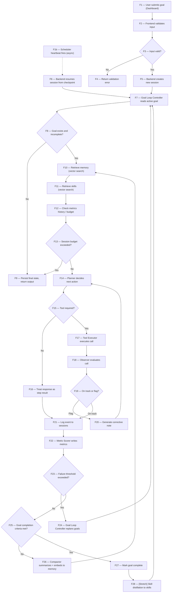

# Long-Horizon Harness — Hackathon SOW

Sep 26, 2026 · @Aaron

## Flowchart



# Flowchart Event Reference

## F1 — User Submits Goal

**Triggered by:** User enters a goal/task description in the Dashboard and clicks start. **Purpose:** Kick off a new long-horizon run. **Inputs:** Free-text goal description, optional constraints/deadline. **Processing:** Dashboard packages the input into a request payload. **Outputs:** POST request to backend API. **State changes:** None yet. **Next event:** F2. **Failure cases:** Network failure — dashboard shows retry. **Implementation notes:** Vercel v0 frontend; simple REST call, no auth needed for hackathon scope.

## F1b — Scheduler Heartbeat Fires

**Triggered by:** Cron/heartbeat timer, independent of any user action — the async entry point that keeps a session alive across hours/days. **Purpose:** Resume a session after a restart, crash, or idle period without requiring the user to be present. **Inputs:** Session ID to resume (from a scheduled-tasks registry or the most recent open session). **Processing:** Fires on an interval; hands off to F6. **Outputs:** Resume trigger. **State changes:** None directly. **Next event:** F6. **Failure cases:** No open session found — heartbeat no-ops and logs a skip. **Implementation notes:** Simplest hackathon version: a cron-style interval process or a scheduled task; this is what proves “hours/days/weeks” rather than a single unbroken chat.

## F2 — Frontend Validates Input

**Triggered by:** F1. **Purpose:** Catch empty/malformed goals before they hit the backend. **Inputs:** Raw goal text. **Processing:** Client-side non-empty/length check. **Outputs:** Valid payload or inline error. **State changes:** None. **Next event:** F3. **Failure cases:** Empty input — blocked before F3. **Implementation notes:** Minimal validation is fine — not a demo-critical path.

## F3 — Input Valid? (decision)

**Triggered by:** F2. **Purpose:** Branch point between error and normal flow. **Inputs:** Validation result. **Processing:** Boolean check. **Outputs:** Route to F4 or F5. **State changes:** None. **Next event:** F4 (No) / F5 (Yes). **Failure cases:** N/A — this is the failure-detection point itself. **Implementation notes:** —

## F4 — Return Validation Error

**Triggered by:** F3 (No branch). **Purpose:** Give the user actionable feedback. **Inputs:** Validation error reason. **Processing:** Render error message. **Outputs:** Error shown in Dashboard. **State changes:** None. **Next event:** None — terminal for this path; user retries at F1. **Failure cases:** N/A. **Implementation notes:** —

## F5 — Backend Creates New Session

**Triggered by:** F3 (Yes branch), first-time goal submission. **Purpose:** Establish a durable session record so the run can be resumed if interrupted. **Inputs:** Goal text, timestamp. **Processing:** Generate session ID; write initial document. **Outputs:** New session ID. **State changes:** Write new document to `sessions`. **Next event:** F7. **Failure cases:** DB write failure — return 500 to Dashboard. **Implementation notes:** Mirrors the LangGraph + MongoDB Atlas checkpointing pattern from the hackathon resource guide.

## F6 — Backend Resumes Session From Checkpoint

**Triggered by:** F1b (scheduler) or a Dashboard “resume” action. **Purpose:** Continue a session exactly where it left off — this is the concrete proof of “coherent memory across a long session.” **Inputs:** Session ID. **Processing:** Read last checkpoint from `sessions`; reconstruct in-memory state (active goal pointer, recent context). **Outputs:** Restored session state. **State changes:** Read from `sessions`; no write yet. **Next event:** F7. **Failure cases:** Session ID not found or checkpoint corrupted — log error, surface to Dashboard, do not silently start a new session. **Implementation notes:** This is the specific action to demo live: kill the process mid-run, fire this path, show it picking up correctly.

## F7 — Goal Loop Controller Reads Active Goal

**Triggered by:** F5, F6, F24, or F28 (loop-back). **Purpose:** Determine what the session should work on next. **Inputs:** Session ID. **Processing:** Query `goals` for this session, sorted by priority/status. **Outputs:** Active goal document, or none. **State changes:** Read from `goals`. **Next event:** F8. **Failure cases:** No goals exist yet for a new session — seed one from the original F1 submission. **Implementation notes:** This is the node the metrics feedback loop (F23/F24) ultimately targets.

## F8 — Goal Exists And Incomplete? (decision)

**Triggered by:** F7. **Purpose:** Decide whether to continue working or wrap up the session. **Inputs:** Goal document (or absence of one). **Processing:** Check status field. **Outputs:** Route to F9 or F10. **State changes:** None. **Next event:** F9 (No) / F10 (Yes). **Failure cases:** N/A. **Implementation notes:** —

## F9 — Persist Final State, Return Output

**Triggered by:** F8 (No branch) or F13 (budget exceeded). **Purpose:** Cleanly end the session and hand results back. **Inputs:** Final session/goal state. **Processing:** Write closing status to `sessions`; assemble summary. **Outputs:** Final response to Dashboard. **State changes:** Write to `sessions`. **Next event:** None — terminal. **Failure cases:** Write failure — retry once, then surface error. **Implementation notes:** This is also where a “all goals complete” success path and a “budget exceeded, stopped early” path both land — differentiate by a status field.

## F10 — Retrieve Memory (vector search)

**Triggered by:** F8 (Yes) or F26 (loop-back within same goal). **Purpose:** Give the Planner relevant compacted history without replaying the full raw transcript — the core “coherent memory” mechanism. **Inputs:** Current goal text/embedding. **Processing:** Voyage AI embeds the goal/subtask; Atlas Vector Search queries `memory` for nearest matches. **Outputs:** Top-k relevant memory summaries. **State changes:** Read from `memory`. **Next event:** F11. **Failure cases:** No memory yet (first cycle) — proceed with empty context, not an error. **Implementation notes:** Automated Embeddings or Voyage AI's API directly; keep k small (3–5) to control token cost.

## F11 — Retrieve Skills (vector search)

**Triggered by:** F10. **Purpose:** Let the Planner reuse a prior successful approach instead of reasoning from scratch every time. **Inputs:** Subtask description/embedding. **Processing:** Vector search `skills` for similarity above threshold. **Outputs:** Matching skill doc(s) or none. **State changes:** Read from `skills`. **Next event:** F12. **Failure cases:** No match — proceed without a skill; this null result is also what triggers F28 later if the step succeeds. **Implementation notes:** Rank by similarity × success rate if `skills` docs track usage/success counts.

## F12 — Check Metrics History / Budget

**Triggered by:** F11. **Purpose:** Give the Planner recent outcome history for this goal, and gather data for the F13 budget check. **Inputs:** Goal ID. **Processing:** Query `metrics` for recent entries on this goal (recency-ordered). **Outputs:** Recent signal history, elapsed time/iteration count. **State changes:** Read from `metrics`. **Next event:** F13. **Failure cases:** No history yet — treat as a fresh goal. **Implementation notes:** —

## F13 — Session Budget Exceeded? (decision)

**Triggered by:** F12. **Purpose:** Stopping condition — prevents an unbounded run from consuming the full credit/time budget. **Inputs:** Elapsed time or iteration count vs. a configured cap. **Processing:** Boolean check. **Outputs:** Route to F9 or F14. **State changes:** None. **Next event:** F9 (Yes) / F14 (No). **Failure cases:** N/A. **Implementation notes:** Mirrors Prime Agent's bounded autonomous-mode quality gates; cap should be configurable for demo pacing.

## F14 — Planner Decides Next Action

**Triggered by:** F13 (No) or F20 (corrective note loop-back). **Purpose:** The core reasoning step — decide what to do next given goal, memory, skills, metrics history, and (if looping from F20) the corrective note. **Inputs:** Goal, retrieved memory, retrieved skill(s), metrics history, optional corrective note. **Processing:** LLM call to Model Provider (OpenRouter/OpenAI/GLM). **Outputs:** A proposed next action (tool call or direct response) plus stated intent. **State changes:** None directly. **Next event:** F15. **Failure cases:** Model provider error/timeout — retry with backoff; repeated failure escalates toward F9 (stop). **Implementation notes:** LangGraph node; this is where the Observer's rubric check #1 (declared-intent match) gets its baseline from — the stated intent here is compared against the actual call at F18.

## F15 — Tool Required? (decision)

**Triggered by:** F14. **Purpose:** Distinguish an action that touches the environment from a direct answer. **Inputs:** Planner output. **Processing:** Check whether output includes a tool call. **Outputs:** Route to F16 or F17. **State changes:** None. **Next event:** F16 (No) / F17 (Yes). **Failure cases:** N/A. **Implementation notes:** *Assumption:* a direct-response path is standard for most agent loops but was not explicitly detailed in our design discussion — confirm during build whether every action in scope always requires a tool.

## F16 — Treat Response As Step Result

**Triggered by:** F15 (No branch). **Purpose:** Let a pure-reasoning step (no tool call) still count as a completed step. **Inputs:** Planner's direct output. **Processing:** Package as a step result. **Outputs:** Step result record. **State changes:** None yet. **Next event:** F21 (skips Observer — no tool call to watch). **Failure cases:** N/A. **Implementation notes:** —

## F17 — Tool Executor Executes Call

**Triggered by:** F15 (Yes branch). **Purpose:** Actually perform the action — run code, call an API, invoke an MCP tool. **Inputs:** Tool name, arguments. **Processing:** Runs in sandbox; may call MCP Services for external tool access. **Outputs:** Raw tool output/result. **State changes:** Whatever the tool itself does externally (file write, API call, etc.). **Next event:** F18. **Failure cases:** Tool error/exception — captured as part of the output the Observer evaluates, not silently swallowed. **Implementation notes:** Sandbox isolation matters if executing arbitrary code — don't run with full user permissions.

## F18 — Observer Evaluates Call

**Triggered by:** F17. **Purpose:** Real-time guardrail — catch a mistake before it's scored or compacted into memory. **Inputs:** The tool call, its output, declared intent from F14, recent history from F12. **Processing:** Small/cheap model plus deterministic checks against a fixed rubric (declared-intent match, repeat-failure, destructive-action guard, proxy-validation check, no-progress check). **Outputs:** Verdict: on track or flag, with a reason if flagged. **State changes:** None directly. **Next event:** F19. **Failure cases:** Observer itself errors/times out — fail open to “on track” with a logged warning, so an Observer outage doesn't halt the whole run (explicit design decision — confirm this is acceptable). **Implementation notes:** Deterministic checks (intent match, repeat-failure, no-progress) run as plain code, no model call; only the destructive-action and proxy-validation checks need an actual small-model call — keeps latency/cost down.

## F19 — On Track Or Flag? (decision)

**Triggered by:** F18. **Purpose:** Branch point for the guardrail. **Inputs:** Observer verdict. **Processing:** Boolean check. **Outputs:** Route to F20 or F21. **State changes:** None. **Next event:** F20 (Flag) / F21 (On track). **Failure cases:** N/A. **Implementation notes:** —

## F20 — Generate Corrective Note

**Triggered by:** F19 (Flag branch). **Purpose:** Interrupt and redirect the Planner without a full rollback/undo mechanism. **Inputs:** Flag reason, evidence, repeat count. **Processing:** Assemble structured note (flag\_reason, evidence, step\_context, suggestion, repeat\_count). **Outputs:** Corrective note object. **State changes:** None (the flagged action itself is not written to `metrics`/`memory`, only to `sessions` via F21 for audit — see note below). **Next event:** F14 (loop back). **Failure cases:** N/A. **Implementation notes:** *Open decision:* whether a flagged event still passes through F21 for audit logging even though it skips F22/F26 — recommended yes, for a full audit trail, but not yet finalized in our discussion.

## F21 — Log Event To Sessions

**Triggered by:** F16, or F19 (On track branch). **Purpose:** Full audit trail — every step gets logged regardless of verdict. **Inputs:** Step result/tool output. **Processing:** Append/write to session document. **Outputs:** Updated session checkpoint. **State changes:** Write to `sessions`. **Next event:** F22. **Failure cases:** Write failure — retry; this is the checkpoint the crash-resume demo depends on, so failures here should be loud, not silent. **Implementation notes:** This write IS the checkpoint that F6 reads on resume.

## F22 — Metric Scorer Writes Metrics

**Triggered by:** F21. **Purpose:** Record a hard, comparable signal for this step — the basis for “learns from hard metric signals.” **Inputs:** Step result, task-specific success criteria. **Processing:** Compute a defined metric (pass/fail, time taken, cost — pick one primary signal per task type). **Outputs:** Metric record. **State changes:** Write to `metrics`. **Next event:** F23. **Failure cases:** Ambiguous outcome — default to a conservative (failing) score rather than silently passing. **Implementation notes:** *Open decision:* the exact metric definition is task-specific and needs to be fixed once the demo task is chosen.

## F23 — Failure Threshold Exceeded? (decision)

**Triggered by:** F22. **Purpose:** Detect when the current approach isn't working and trigger a replan rather than repeating it. **Inputs:** Recent metric history for this goal. **Processing:** Compare consecutive-failure count against a threshold. **Outputs:** Route to F24 or F25. **State changes:** None. **Next event:** F24 (Yes) / F25 (No). **Failure cases:** N/A. **Implementation notes:** This is the metrics-feedback loop discussed as the project's core differentiator versus a harness that only logs outcomes without acting on them.

## F24 — Goal Loop Controller Replans Goals

**Triggered by:** F23 (Yes branch). **Purpose:** Change strategy or deprioritize a goal that's demonstrably not working. **Inputs:** Goal ID, failure history. **Processing:** Update goal priority/status/strategy notes. **Outputs:** Updated goal document. **State changes:** Write to `goals`. **Next event:** F7 (loop back). **Failure cases:** No alternative goal/strategy available — falls through to F8 finding no viable goal, ending at F9. **Implementation notes:** This write is the literal, demoable “the harness changed its plan because of an outcome” moment.

## F25 — Goal Completion Criteria Met? (decision)

**Triggered by:** F22 path when F23 is No. **Purpose:** Determine whether this step finished the goal or more work remains. **Inputs:** Goal's defined success criteria, current step result. **Processing:** Boolean/threshold check. **Outputs:** Route to F26 or F27. **State changes:** None. **Next event:** F26 (No) / F27 (Yes). **Failure cases:** N/A. **Implementation notes:** —

## F26 — Compactor Summarizes + Embeds To Memory

**Triggered by:** F25 (No branch). **Purpose:** Turn a raw step into a compact, retrievable memory entry — this is what keeps the session coherent without replaying full history every cycle. **Inputs:** Recent step(s) transcript. **Processing:** Summarize (LLM call), embed the summary via Voyage AI. **Outputs:** Compacted memory entry with embedding. **State changes:** Write to `memory`. **Next event:** F10 (loop back for next action, same goal). **Failure cases:** Embedding API error — retry; on repeated failure, store the summary unembedded rather than losing it, and flag for later re-embedding. **Implementation notes:** This is the token-count-shrinking step worth surfacing visibly on the Dashboard (before/after size).

## F27 — Mark Goal Complete

**Triggered by:** F25 (Yes branch). **Purpose:** Close out a finished goal. **Inputs:** Goal ID. **Processing:** Update status field. **Outputs:** Updated goal document. **State changes:** Write to `goals`. **Next event:** F28. **Failure cases:** Write failure — retry. **Implementation notes:** —

## F28 — \[Stretch\] Skill Distillation

**Triggered by:** F27, only when F11 found no matching skill for this goal. **Purpose:** Let the skills library genuinely grow from the session's own experience — the one piece of real self-improvement in this design, discussed as an optional addition rather than a committed requirement. **Inputs:** The successful trajectory that solved the goal. **Processing:** Summarize the approach into a reusable skill description, embed it. **Outputs:** New skill document. **State changes:** Write to `skills`. **Next event:** F7 (loop back — check for next goal). **Failure cases:** N/A — this step is skippable entirely under time pressure without breaking the rest of the loop. **Implementation notes:** Explicitly marked stretch/Phase 2 — build the rest of the loop first; see Section 4 (Build Plan) and Section 9 (Out of Scope).

# 1. Project Overview

**Working title:** *(not yet chosen — open decision, pick a name during kickoff)*

**One-sentence description:** A long-horizon agent harness that keeps a session coherent across restarts using MongoDB-backed compacted memory, replans its goals from accumulated hard-metric outcomes rather than just logging them, and catches mistakes in real time via a lightweight observer before they're scored or remembered.

**Problem being solved:** Long-running agent sessions typically fail in one of two ways — they either lose coherence (forget earlier context, drift off the original goal) or they accumulate mistakes silently because nothing checks outcomes against a hard signal and feeds that back into planning. Most “agent with memory” demos solve storage, not learning.

**Why it matters:** Statement Two explicitly asks for work that spans “hours, days, or weeks” with memory that stays coherent and a harness that “relentlessly optimizes toward long-term goals” and “learns from hard metric signals.” Most memory systems persist state; few close the loop from outcome back to plan.

**Target user (for the demo):** A hackathon judge evaluating whether the harness (a) survives an interruption without losing context, (b) visibly changes its plan because of a real outcome, and (c) catches a mistake before it corrupts memory.

**Core value proposition:** Not “we stored a lot of context” — the differentiator is that outcomes measurably change future planning, and that a lightweight watcher prevents bad steps from ever being counted as good ones.

**What makes it technically interesting:** Three mechanisms most comparable projects skip: (1) a metrics-driven replan loop, not just outcome logging; (2) memory that compacts and embeds rather than growing unboundedly; (3) a small, cheap observer model gating what gets written to memory/metrics at all, rather than trusting every step by default.

# 2. Hackathon Thesis

**What we're demonstrating:** A harness where (a) killing and resuming the process mid-run does not lose task coherence, (b) a real outcome visibly changes what goal/strategy the harness pursues next, and (c) a cheap real-time check stops a bad action before it's written into memory or counted as progress.

**Fit to Statement Two:** All three demo beats map directly to the three clauses of the prompt — coherent memory across a long session, relentless pursuit of long-term goals, and learning from hard metric signals — rather than answering only one of them.

**Key technical insight:** Most memory-for-agents projects treat memory as a write-once log. The insight here is that memory quality depends on what's allowed *into* it — an observer gate that keeps mistakes out of the compacted memory and metrics history is what makes the metrics-driven replanning trustworthy in the first place. Without the gate, a noisy or wrong step could get scored as a valid data point and corrupt the very signal the replanning loop depends on.

**What should make a judge say “this is more than a memory demo”:** Seeing the feedback loop fire live — a goal document's priority/status changing in MongoDB in response to an actual accumulated failure pattern, not a scripted transition — plus seeing a deliberately-bad action get caught and rejected by the observer before it reaches the metrics or memory collections.

**Explicit comparison points (for judge Q&A):** This project extends Prime Agent's harness-state architecture (session/context-compaction/goals/skills modules) by moving that state into MongoDB and adding the metrics-feedback and observer mechanisms Prime Agent's published architecture does not include. It deliberately does *not* implement Prime Agent's or the AHE paper's harness self-refinement mechanism — that is Statement One's territory, and building it would blur this project's claim rather than sharpen it (see Section 9).

# 3. System Architecture & MongoDB Data Model

**Component summary** (full detail in the Flowchart Event Reference above):

| Layer | Component | Role |
| --- | --- | --- |
| Entry | Dashboard (Vercel v0) | User starts/monitors a session |
| Entry | Scheduler / heartbeat | Async resume trigger for long-running sessions |
| Runtime | Goal Loop Controller | Picks active goal, applies replans |
| Runtime | Planner | Decides next action (Model Provider call) |
| Runtime | Tool Executor | Runs actions in sandbox, calls MCP Services |
| Runtime | Observer | Real-time guardrail on every tool call |
| Runtime | Metric Scorer | Computes hard signal, triggers replan |
| Runtime | Compactor | Summarizes + embeds via Voyage AI |
| Data | MongoDB Atlas | All persistent state (below) |

**MongoDB collections — schemas**

`sessions`

```
{
  _id: ObjectId,
  session_id: string,
  status: "active" | "complete" | "stopped",
  created_at: datetime,
  last_checkpoint_at: datetime,
  events: [
    { ts: datetime, type: "tool_call" | "response" | "flagged", payload: {...}, observer_verdict: "on_track" | "flagged" | null }
  ]
}
```

`goals`

```
{
  _id: ObjectId,
  session_id: string,
  goal_id: string,
  description: string,
  status: "pending" | "active" | "blocked" | "complete",
  priority: number,
  strategy_notes: string,       // updated by replan (F24)
  last_replanned_at: datetime,
  completion_criteria: string
}
```

`metrics`

```
{
  _id: ObjectId,
  session_id: string,
  goal_id: string,
  ts: datetime,
  signal: number,                // primary hard signal, task-specific — open decision
  outcome: "success" | "failure",
  detail: string
}
```

`memory`

```
{
  _id: ObjectId,
  session_id: string,
  goal_id: string,
  summary: string,
  embedding: [float],            // Voyage AI vector, Atlas Vector Search index
  source_event_range: [string],  // which sessions.events this compacted
  created_at: datetime
}
```

`skills`

```
{
  _id: ObjectId,
  description: string,
  embedding: [float],            // Atlas Vector Search index
  uses: number,
  successes: number,             // for similarity × success-rate ranking
  created_at: datetime,
  source: "seed" | "distilled"   // distilled = written by F28 (stretch)
}
```

**Open decisions:** exact primary metric definition per task type; whether `harness_state` (harness self-refinement) is added at all — current recommendation is no, per Section 9.

# 4. Technical Build Plan

Ordered by priority — each phase should be independently demoable if time runs out before the next one.

| Phase | Scope | Flowchart nodes | Cut line |
| --- | --- | --- | --- |
| 0 | Setup: Atlas Sandbox, Agent Skills, MCP Server, LangGraph+Mongo checkpoint example | — | Do first, before any custom code |
| 1 | Core loop: session create/resume, goal read, planner → tool executor → log to `sessions` | F1–F9, F14, F17, F21 | Minimum viable demo |
| 2 | Compaction + vector search: `memory` writes/reads via Voyage AI | F10, F26 | Second demo beat |
| 3 | Metrics + replan loop: `metrics` writes, F23/F24 feedback into `goals` | F12, F13, F22–F25, F27 | **This is the differentiator — protect this over polish elsewhere** |
| 4 | Skills retrieval: `skills` vector search | F11 | Cut before Phase 3 if time-constrained |
| 5 | Observer: rubric checks, flag/on-track branch | F18–F20 | Build last, only once Phases 1–3 are solid — needs real traces to tune the rubric |
| 6 | Dashboard: goal state, metric chart with replan markers, transcript feed, compaction events, skills list | — | Build in parallel once Phase 1 API shapes are fixed |
| Stretch | Skill distillation (F28) | F28 | First thing cut if behind schedule |
| Explicitly cut | Harness self-refinement (`harness_state`) | — | Not built — see Section 9 |

**Sequencing note:** Phases 1–3 form the complete, demoable core (“this is more than a memory demo” requires Phase 3 specifically). Phases 4–6 improve the demo but are not required to prove the thesis. The Observer (Phase 5) is powerful but risky to rush — an untested rubric that false-flags a working action live is worse than no observer.

# 5. Team Roles & Work Breakdown

*Assumption: sized for up to 4 members per hackathon rules; adjust to actual team size and skills — this is a suggested split, not a fixed assignment.*

| Role | Owns | Primary phases |
| --- | --- | --- |
| Backend / Agent Loop | Goal Loop Controller, Planner, Tool Executor, LangGraph wiring | Phase 1, 3 |
| Data / MongoDB | Schema setup, indexes (incl. Atlas Vector Search), all collection read/write paths | Phase 0, 1, 2, 3, 4 |
| Memory & Retrieval | Compactor, Voyage AI integration, skills retrieval | Phase 2, 4 |
| Frontend / Demo | Vercel v0 dashboard, demo script rehearsal, submission video | Phase 6 |

The Observer (Phase 5) should be picked up by whichever pair finishes their primary phase first — it depends on Phases 1–3 already working and is the most time-elastic piece.

**Coordination note:** Phase 1 defines the API/data shapes every other phase depends on — lock those field names early (see Section 3 schemas) so parallel work on Phases 2–4 doesn't need rework.

# 6. Demo Script

1. **Start a session** from the Dashboard with a chosen long-horizon task (task selection is an open decision — needs a task with a clear, checkable hard signal).
2. **Let it run a few cycles** — show the goal panel, live transcript, and a compaction event firing (before/after token size) on the dashboard.
3. **Kill the backend process mid-run.** This is the single most important beat: prove the session isn't just a long chat log.
4. **Fire the scheduler/resume path (F1b → F6)** and show the session picking up from the exact last checkpoint in `sessions`, with prior context still available via `memory`.
5. **Force or wait for a failure pattern** on a goal, and show the metric chart's replan marker firing — point at the `goals` document in MongoDB changing priority/strategy live.
6. **Trigger a deliberately bad action** (e.g., a destructive or proxy-validation-style call) and show the Observer flagging it — the corrective note, and that the action never appears in `metrics` or `memory`.
7. **Close with the metric trend chart** showing the goal eventually succeeding after the replan, as the concrete “learned from a hard signal” artifact.

**Submission requirements to keep in mind throughout:** 1-minute demo video, public GitHub repo, built in the MongoDB Atlas Hackathon Sandbox to be finalist-eligible.

# 7. Risks & Mitigations

| Risk | Impact | Mitigation |
| --- | --- | --- |
| Observer rubric false-flags working actions live | Demo looks broken | Build Observer last (Phase 5), test against real traces before demo, fail-open on Observer error |
| Atlas Sandbox / index setup friction eats early hours | Delays everything downstream | Do Phase 0 (setup + Agent Skills + MCP Server + quickstart) first, before writing custom logic |
| Model Provider credits run out mid-hack | Blocks Planner/Observer calls | Use small/cheap model for Observer calls specifically; monitor OpenRouter/OpenAI usage |
| Voyage AI embedding calls fail or rate-limit | Compaction/retrieval breaks | 200M free tokens should comfortably cover hackathon scope; add basic retry |
| Session budget/stopping logic missing | Live demo could run indefinitely or never stop | F13 stopping condition is not optional — build it in Phase 1, not later |
| Team runs out of time before Phase 3 | Loses the actual differentiator | Explicit cut order in Section 4 protects Phase 3 over Phases 4–6 |
| Metric definition left vague | Replan loop has nothing real to react to | Fix the primary hard signal per task type before Phase 3 starts, not during |

# 8. Success Criteria / Definition of Done

**Minimum viable submission (must have):**

- [ ] Core loop (Phase 1) working end to end against real MongoDB Atlas Sandbox data
- [ ] Session survives a kill/restart via checkpoint resume, demoed live
- [ ] Compaction writes real embeddings to `memory` (Phase 2)
- [ ] At least one real replan event visibly changes a `goals` document from a real metric outcome (Phase 3) — this is non-negotiable given the thesis
- [ ] Public GitHub repo, 1-minute demo video, built in the Atlas Hackathon Sandbox

**Strong submission (should have):**

- [ ] Skills retrieval (Phase 4) working with at least a few seeded skills
- [ ] Observer (Phase 5) catching at least one real or staged mistake live
- [ ] Dashboard (Phase 6) showing all five panels from the design discussion

**Stretch (nice to have):**

- [ ] Skill distillation (F28) writing a new skill from a real successful run

Anything not checked off in “Minimum viable” by the mid-point of the hackathon should trigger re-scoping, not silent schedule slip.

# 9. Explicit Out of Scope

- **Harness self-refinement** (a `harness_state`/refinement mechanism that rewrites the harness's own rules, tools, or prompts). This is Statement One's territory; building it here would dilute this project's specific claim about memory and goal persistence. Discussed at length as a deliberate exclusion, not an oversight.
- **Human-in-the-loop approval UI.** The Observer's destructive-action check could in principle route to a human approval step, but no such UI has been designed or discussed — flagged actions currently route back to the Planner automatically, not to a person.
- **Skill distillation (F28) as a committed feature.** Discussed as genuinely valuable but explicitly optional — treat as Phase-6-or-later stretch, not core to the thesis.
- **Undo/rollback of executed actions.** The Observer interrupts and redirects the Planner; it does not attempt to reverse an action already taken.
- **Multi-agent swarms / parallel worker orchestration** (the Longshot-style pattern discussed earlier in scoping). Explicitly rejected for this project both for rule reasons (prior public submission) and infrastructure mismatch (no Modal-style sandbox credits in this hackathon's resource set).
- **Production-grade auth, multi-tenant sessions, or billing.** Out of scope for a one-day build.
